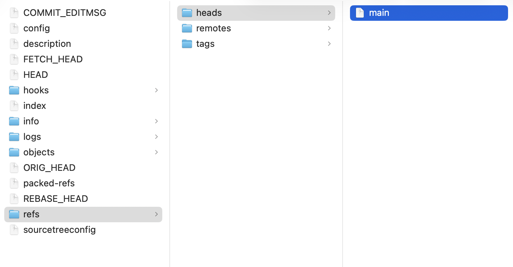
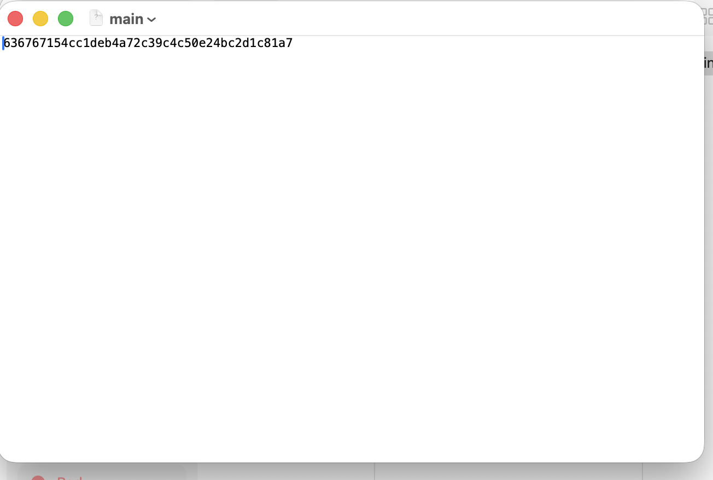

# Useful info about Git & Github 

- Visit https://git-scm.com/ for more details on git commands and usages.

## Notes/considerations

- use atomic commits > commits focused on 'a single thing'. Make the commits be clear and don't 'pollute' them with lots of stuff. It then will be easier to track changes, revert, update, etc.
- from git [docs](https://git.kernel.org/pub/scm/git/git.git/tree/Documentation/SubmittingPatches?h=v2.36.1#n181) > use 'present tense imperative' when adding the message for your commit.
    - ex: 'Update method to use 2 parameters' instead of 'I updated the method to use 2 parameters'
- use the `.gitignore` file to ignore files from being tracked by git
    - useful resource: https://www.toptal.com/developers/gitignore
- what is `HEAD` from git? 
    - pointer that refers to the current 'location' in your repo
    - points to a branch reference (HEAD references a branch)
        - branch points to a commit
    - `refs/heads/` folder from within the `.git` folder will have 1 file for each of your branches. Each file will contain a reference to the last commit from that branch
    - ex: opening `refs/heads/main` will show you the last commit from the `main` branch

    
    
- there may be times (ex: when creating a new file) when switching to another branch will also 'drag' your local changes (the file added) with you

## GUI Clients

- GitKraken
- Tower
- Github Desktop
- Ungit
- Sourcetree

## git commands

- `git init` > create a repo at the current folder path. Will create a `.git` folder
- `remove .git` > will delete the repo
- `git log` > shows the history of commits
- `git config --global [configurations]` > make changes inside the configuration file. Will apply changes for ALL local repos
    - Ex: `git config --global user.name "Cristian"` > configures/sets "Cristian" as the author's name for commit messages
    - Ex: `git config --global user.emal "myEmail@provider.com"` > configures/sets "myEmail@provider.com" as the author's email for commit messages
    - Ex: `git config --global user.name` > displays what global name was set as the author's name for commit messages
    - Ex: `git config --global core.editor "..."` > use this to set your default editor when adding messages to your commits (when you omit the `-m` parameter for `git commit`)
        - Ex: VSCode: `git config --global core.editor "code --wait"` . also pls check out [this thread](https://stackoverflow.com/questions/30024353/how-can-i-use-visual-studio-code-as-default-editor-for-git) from Stackoverflow on how to properly set this for VSCode
- `git status` > shows info about repo's current status, branch you're currently on, changed files, etc. 
    - Ex: 
        ```bash 
        On branch main
        Your branch is up to date with 'origin/main'.

        Changes not staged for commit:
            (use "git add <file>..." to update what will be committed)
            (use "git restore <file>..." to discard changes in working directory)
            modified:   git.md

        no changes added to commit (use "git add" and/or "git commit -a")
        ```
- `git add file1 file2 file3 ...` > will add the files to the staging area, preparing them for being commited
    - `git add .` > adds all changed files to the staging area
- `git commit -m "commit message"` > creates a commit with the "commit message" message. If you just run `git commit` this will open your default text editor (set for git) and prompt you to enter the commit's message
- `git log --abbrev-commit` > shows the git history but uses shorther commit hash (instead of all characters from the commit's hash)
- `git log --oneline` > shows the git history but displays only the first line from the commit message
- `git commit --ammend` > "redo" previous commit.
    - useful when you forgot to add something to a commit or when you'd like to update the commit's message
- `git branch` > shows all branches 
- `git branch <branchName>` > create the `branchName` branch 
- `git switch <branchName>` > switch to the `branchName` branch 
    - or `git checkout <branchName>`
- `git switch -c <branchName>` > create & switch to the `branchName` branch 
    - or `git checkout -b <branchName>`
- `git branch -d <branchName>` > delete the `branchName` branch 
    - for this to work, you need to be on a different branch than the one you want to delete
    - there's also a `force delete` (when the branch is not merged) > `git branch -D <branchName>`
- `git branch -m <branchName>` > rename the current branch you're on to 'branchName'
    - you need to be checked out on the branch you want to rename
- `git merge <branchName` 
    - merges work from `branchName` into your current branch 
    - Ex: 
        ```bash
        git switch main
        git merge bugfix
        ``` 
        - will merge changes from the `bugfix` branch into `main`
        - merge changes from a branch into your current branch 
        - need to be checked out on the 'receiving' branch and 'receive' (merge) changes from another branch

## macOS/Terminal commands 

Especially useful when interacting/using git from the Terminal

- `open .` > opens the current folder in Finder
- `ls folderName` > lists the content of folderName
- `open folderName` > opens the folderName folder inside Finder
- `touch file.txt` > creates file.txt
- `touch file1.txt file2.txt file3.txt` > creates multiple files at once
- `touch path/to/file/file.txt` > creates file.txt at the specified path: path/to/file/
- `rm fileName` > deletes fileName from current folder
- `rm -rf folderName` > deletes folderName folder (`rf` stands for `recursive` and `force`)